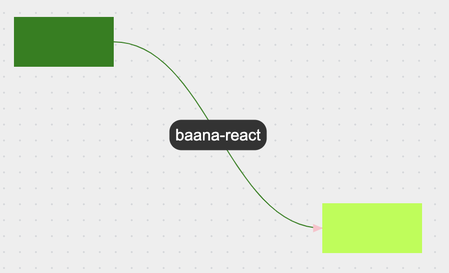

# baana-react



- Zero-dependencies
- 12 kB bundle size

## Usage

```jsx
const Diagram = () => {
    return (
        <>
            <div id="block1"></div>
            <div id="block2"></div>
            <Arrow start="block1" end="block2"/>
        </>
    );
}

const App = () => {
    return (
        <LineContextProvider>
            <Diagram />
        </LineContextProvider>
    )
}
```

## API

| Arrow Property      | Type                                                | Property in `LineContextProvider` |
| ------------------- | --------------------------------------------------- | --------------------------------- |
| `start`             | `React.RefObject<HTMLElement> \| string` (block id) | -                                 |
| `end`               | `React.RefObject<HTMLElement> \| string` (block id) | -                                 |
| `color`             | `string`                                            | `color`                           |
| `scale`             | `number`                                            | `scale`                           |
| `curviness`         | `number`                                            | `curviness`                       |
| `strokeWidth`       | `number`                                            | `strokeWidth`                     |
| `useRegister`       | `boolean`                                           | `useRegister`                     |
| `withHead`          | `boolean`                                           | `withHead`                        |
| `headSize`          | `number`                                            | `headSize`                        |
| `headColor`         | `string`                                            | `headColor`                       |
| `className`         | `string`                                            | `arrowClassName`                  |
| `onClick`           | `MouseEventHandler`                                 | -                                 |
| `onHover`           | `MouseEventHandler`                                 | -                                 |
| `label`             | `JSX.Element`                                       | -                                 |
| `Marker`            | `MarkerPropsType`                                   | -                                 |
| `offsetStartX`      | `number`                                            | `offsetStartX`                    |
| `offsetStartY`      | `number`                                            | `offsetStartY`                    |
| `offsetEndX`        | `number`                                            | `offsetEndX`                      |
| `offsetEndY`        | `number`                                            | `offsetEndY`                      |

```ts
type MarkerPropsType = {
    id: string;
    size?: number;
    color?: string;
};
```

`LineContextProvider` allows to set some properties for all arrows in it at once.

## Optimization

### Hook useReducedGraphics

- It is needed to increase FPS due to a temporary decrease in rendering quality
- Default delay: `400 ms`
- Based on `shape-rendering: optimizeSpeed` [[MDN]](https://developer.mozilla.org/en-US/docs/Web/SVG/Attribute/shape-rendering)

```jsx
const { reducedClassName, reduceSVG } = useReducedGraphics();

const someAction = () => {
    ...
    reduceSVG();
}

return (
    <LineContextProvider arrowClassName={reducedClassName}>
        ... // arrows and other content
    </LineContextProvider>
);
```

### Update only changed arrows

This feature is hidden behind the property `useRegister`, as it requires a little extra memory.

After enabling, you can pass the HTML element corresponding to the `start` or `end` of the arrow to the update function.

<details>
<summary>Example</summary>

Made with `react-draggable`.

```jsx
const Diagram = () => {
    const { update } = useLineContext();

    const handleUpdate = (mouseEvent, dragEvent) => {
        update(dragEvent.node);
    };

    return (
        <>
            <Draggable
                onDrag={handleUpdate}
                onStart={handleUpdate}
                onStop={handleUpdate}
            >
                <div id="block1"></div>
            </Draggable>

            <Draggable
                onDrag={handleUpdate}
                onStart={handleUpdate}
                onStop={handleUpdate}
            >
                <div id="block2"></div>
            </Draggable>

            <Arrow start="block1" end="block2"/>
        </>
    );
}

const App = () => {
    return (
        <LineContextProvider>
            <Diagram />
        </LineContextProvider>
    )
}
```
</details>
